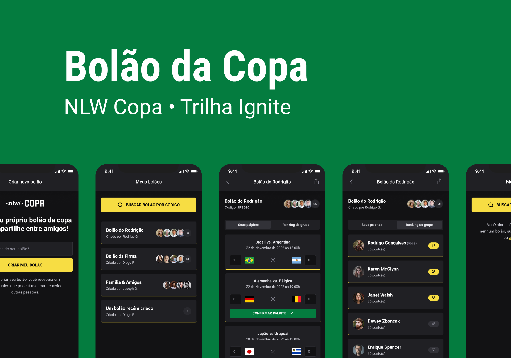

   

# Server

   

## 🚀 Como executar

- Instale os pacotes com `npm install`.
- Execute `npm run dev` para iniciar o servidor.

## 👩🏻‍💻 Tecnologias utilizadas 

- Prisma, uma ORM que faz as migrations pro banco de dados com o comando `npx prisma migrate dev`
- Neste projeto eu estou utilizando o SQLite
- Socket.io(Auxilia na comunicação entre as aplicações(cliente e servidor))
- Typescript
- Fastify
- JWT(Json Web Token)

# Mobile

   

## 🚀 Como executar

- Instale os pacotes com `npm install`.
- Logo depois, abra o terminal e execute `npm run start` para iniciar o expo.
- Com o Android Studio copie o endereço local acima do QRCode ou pressione `a`.
- Conectando com o Expo no Dispositivo, basta escanear o QRCode.✨

## 👩🏻‍💻 Tecnologias utilizadas 
- React Native
- Native Base
- Axios
- Expo
- Autenticação conta Google(API)

# WebSite

   

## 🚀 Como executar

- Instale os pacotes com `npm install`.
- Execute `npm run dev` para iniciar o servidor.

## 👩🏻‍💻 Tecnologias utilizadas 
- React
- Next.js
- Tailwind CSS

